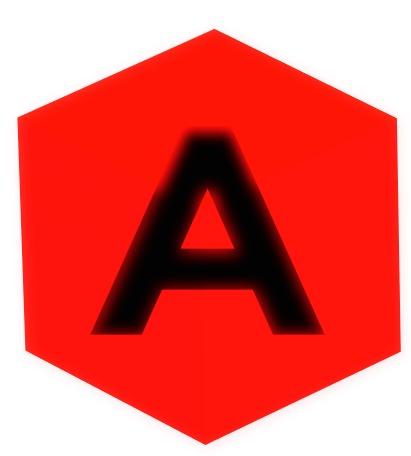

# Axiom Engine



Axiom Engine is a Cocos2d-x 4.0 fork updated to work with Python 3.

This project is open source and licensed under the MIT License.

## Build

```bash
cmake -S . -B build
cmake --build build
```

Java scripting support is enabled automatically when CMake can find a full JDK
with both `java` and `javac`. If only a Java runtime is available, Axiom still
builds and reports Java scripting as unavailable at runtime.

## Run

```bash
./build/axiom_app
```

## Web Games

Axiom can also host lightweight web game experiments with plain HTML, CSS, and
JavaScript. Open `web/index.html` in a browser to run the starter canvas loop.
